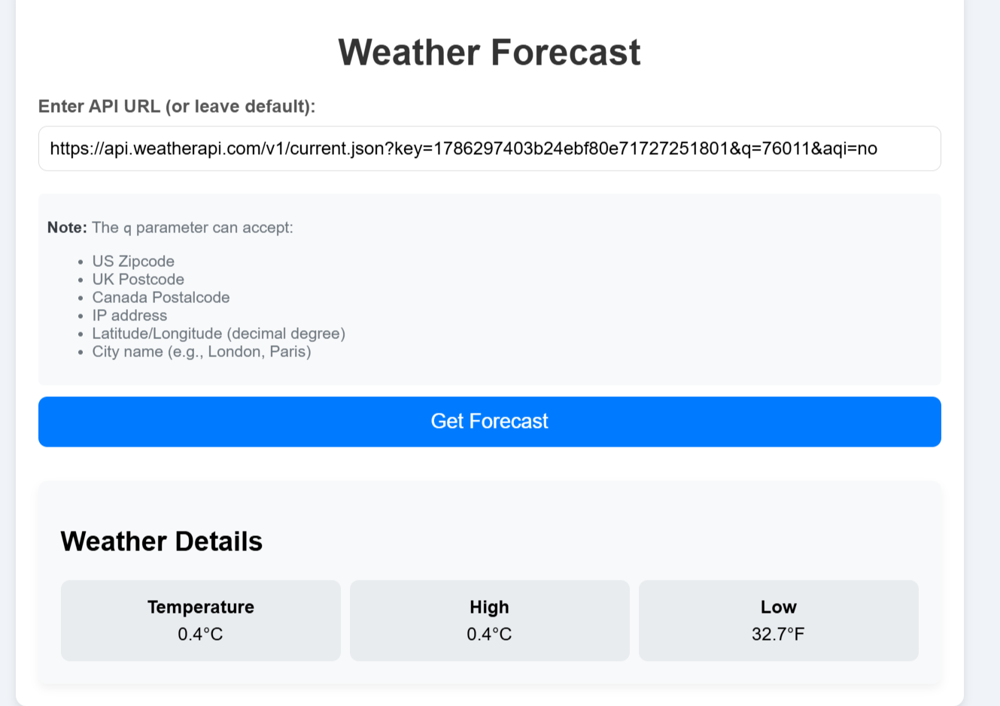

# Weather Forecast Application

A Ruby on Rails application that provides weather forecasts with intelligent caching using WeatherAPI.com.

## User Interface



The application provides a simple interface where users can:
- Enter or use the default WeatherAPI URL
- View current temperature, high, and low
- Get weather data with caching status

## Features

- ZIP code-based weather lookup
- Current temperature with high/low display
- 30-minute caching by ZIP code
- Cache status indicator in responses
- RESTful JSON API

## Technical Stack

- Ruby 3.2.2
- Rails 8.0.1
- WeatherAPI.com Integration
- Faraday for HTTP requests
- RSpec for testing

## Installation

1. Clone the repository:
```bash
cd weather_forecast_app
```

2. Install dependencies:
```bash
bundle install
```

3. Start the server:
```bash
rails server
```

## Code Structure

### WeatherService
```ruby
# app/services/weather_service.rb
# Handles weather data fetching and ZIP code extraction
# Responsible for API communication and data formatting
```

### WeatherForecastController
```ruby
# app/controllers/weather_forecast_controller.rb
# Manages weather requests and caching
# Returns JSON responses with weather data and cache status
```

## API Endpoints

### GET /
- Shows the weather input form

### GET /show
- Parameters: 
  - `api_url`: WeatherAPI URL with ZIP code
- Returns:
```json
{
  "weather_data": {
    "temperature": 20.5,
    "high": 20.5,
    "low": 68.9
  },
  "from_cache": true/false
}
```

## Caching Implementation

- Uses Rails.cache
- 30-minute cache duration
- ZIP code as cache key
- Cache status indicator in response

## Testing

The project includes RSpec tests covering:
```bash
bundle exec rspec
```

- WeatherService specs
  - ZIP code extraction
  - Weather data fetching
  - Error handling

- WeatherForecastController specs
  - Caching behavior
  - API responses
  - Error scenarios

## Key Design Patterns

1. **Service Object Pattern**
   - WeatherService for API interaction
   - Separation of concerns

2. **Cache-Aside Pattern**
   - Efficient data caching
   - Cache miss handling

## Error Handling

Handles:
- Invalid ZIP codes
- API failures
- JSON parsing errors
- Cache misses

## Dependencies

Key gems:
- `faraday`: HTTP client
- `rspec-rails`: Testing framework
- `webmock`: API testing
- `rails-controller-testing`: Controller specs
- `solid_cache`: Caching support

## Contributing

1. Fork the repository
2. Create your feature branch
3. Submit a Pull Request

## License

MIT License

## Acknowledgments

- WeatherAPI.com for weather data
- Rails community

## WeatherAPI Integration Guide

### API Key Setup
1. Sign up at [WeatherAPI.com](https://www.weatherapi.com)
2. Get your free API key from the dashboard
3. The app currently uses a demo key: `1786297403b24ebf80e71727251801`
4. For production, replace with your own key in the API URL

### API URL Format
```
https://api.weatherapi.com/v1/current.json?key=YOUR_API_KEY&q=ZIP_CODE&aqi=no
```

Parameters:
- `key`: Your WeatherAPI authentication key
- `q`: ZIP code (e.g., 76011)
- `aqi`: Air quality data (set to 'no' by default)

### Example Usage

1. Using the default URL:
```bash
GET /show?api_url=https://api.weatherapi.com/v1/current.json?key=1786297403b24ebf80e71727251801&q=76011&aqi=no
```

2. Response format:
```json
{
  "weather_data": {
    "temperature": 20.5,  // Current temperature in Celsius
    "high": 20.5,        // High temperature
    "low": 68.9         // Low temperature in Fahrenheit
  },
  "from_cache": false    // Indicates if data is from cache
}
```

### Rate Limits
- Free tier: 1 million calls/month
- Data updates: Every 15-30 minutes
- Cache duration: 30 minutes in this application

### Error Responses

1. Invalid ZIP Code:
```json
{
  "error_message": "No ZIP code found in the API URL."
}
```

2. API Error:
```json
{
  "weather_data": null
}
```

### Testing the API

Use the provided RSpec tests to verify API integration:
```bash
bundle exec rspec spec/services/weather_service_spec.rb
```
